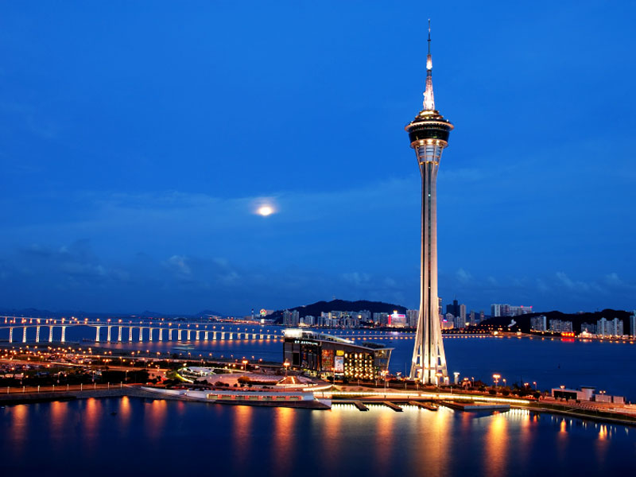

# Neural Algorithm of Artistic Style #

This repository holds a course project for EL-GY 6123 Image and Video Processing given by professor Yao Wang at New York University. 
It implements and extends "[A Neural Algorithm of Artistic Style](http://arxiv.org/abs/1508.06576)".

Its original version can be found at [https://github.com/log0/neural-style-painting](https://github.com/log0/neural-style-painting). 
You can do it through the IPython Notebook available [here](./main.ipynb)! 
This code is documented so you can follow along while reading with the paper. 
You can also just replace with your own images and to generate your new painting.

Current version rewrites VGG-19 model from .mat into .pkl so that loading and using the model are easier. 
The .pkl VGG-19 model is included in the repository with lfs.
The original .mat VGG-19 model can be downloaded at [VGG-19 model](http://www.vlfeat.org/matconvnet/models/imagenet-vgg-verydeep-19.mat).
It can then be rewritten into .pkl with vgg_helper.mat2pkl

Example results:

Using the StarryNight:

# How to run

You will need to install dependencies:

- TensorFlow
- Scipy
- Numpy
- matplotlib
- pickle
- PIL
- lfs

Then go through the [main.ipynb](./main.ipynb) step by step.

References:
- [A Neural Algorithm of Artistic Style](http://arxiv.org/abs/1508.06576)
- [https://github.com/jcjohnson/neural-style](https://github.com/jcjohnson/neural-style)
- [https://github.com/ckmarkoh/neuralart_tensorflow](https://github.com/ckmarkoh/neuralart_tensorflow)
- [https://github.com/log0/neural-style-painting](https://github.com/log0/neural-style-painting)
